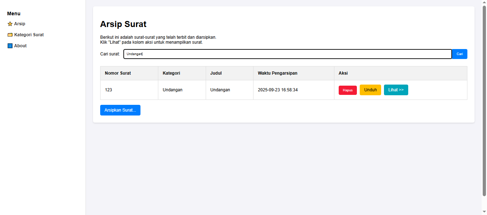

# Aplikasi Arsip Surat Sederhana

Aplikasi web sederhana yang dibangun menggunakan framework Laravel untuk melakukan manajemen dan pengarsipan surat digital dalam format PDF. Proyek ini mencakup fungsionalitas CRUD (Create, Read, Update, Delete) penuh untuk data surat dan kategori surat.

## Screenshot

<ol>

### 1. Melihat data kategori


### 2. Menambahkan data kategori


### 3. Mengedit data kategori


### 4. Menghapus data kategori


### 5. Melakukan Pencarian Surat


### 6. Melihat surat yang diarsipkan


### 7. Menambahkan data surat


### 8. Mengedit data surat


### 9. Menghapus data surat


### 10. Mengunduh Surat


### 11. Halaman About


</ol>

---

## Fitur Utama ✨
* **Arsipkan Surat**: Mengunggah file surat dalam format PDF beserta detailnya (nomor, judul, kategori).
* **Kategori Surat**: Menambah, mengedit, dan menghapus kategori surat untuk pengelompokan.
* **Lihat Surat**: Menampilkan file PDF langsung di dalam browser.
* **Unduh Surat**: Mengunduh file PDF yang telah diarsipkan.
* **Hapus Surat**: Menghapus data surat beserta file fisiknya dari storage.
* **Edit Surat**: Memperbarui detail surat dan mengganti file PDF jika diperlukan.
* **Pencarian**: Mencari surat berdasarkan judul.

---

## Teknologi yang Digunakan 💻
* **Framework**: Laravel 10 / 11
* **Database**: MySQL
* **Frontend**: Blade Templating Engine, HTML, CSS
* **Server Development**: `php artisan serve`

---

## Cara Instalasi & Menjalankan Proyek
1.  **Clone repository ini:**
    ```bash
    git clone [https://github.com/NAMA_USER_ANDA/NAMA_REPO_ANDA.git](https://github.com/NAMA_USER_ANDA/NAMA_REPO_ANDA.git)
    ```
2.  **Masuk ke direktori proyek:**
    ```bash
    cd NAMA_REPO_ANDA
    ```
3.  **Install semua dependency:**
    ```bash
    composer install
    ```
4.  **Salin file `.env.example` menjadi `.env`:**
    ```bash
    cp .env.example .env
    ```
5.  **Generate kunci aplikasi:**
    ```bash
    php artisan key:generate
    ```
6.  **Konfigurasi database Anda di file `.env`:**
    ```env
    DB_CONNECTION=mysql
    DB_HOST=127.0.0.1
    DB_PORT=3306
    DB_DATABASE=db_arsip_surat
    DB_USERNAME=root
    DB_PASSWORD=
    ```
7.  **Jalankan migrasi untuk membuat tabel di database:**
    ```bash
    php artisan migrate
    ```
8.  **Buat symbolic link untuk storage:**
    ```bash
    php artisan storage:link
    ```
9.  **Jalankan server development:**
    ```bash
    php artisan serve
    ```
10. **Buka aplikasi di browser:** `http://127.0.0.1:8000`